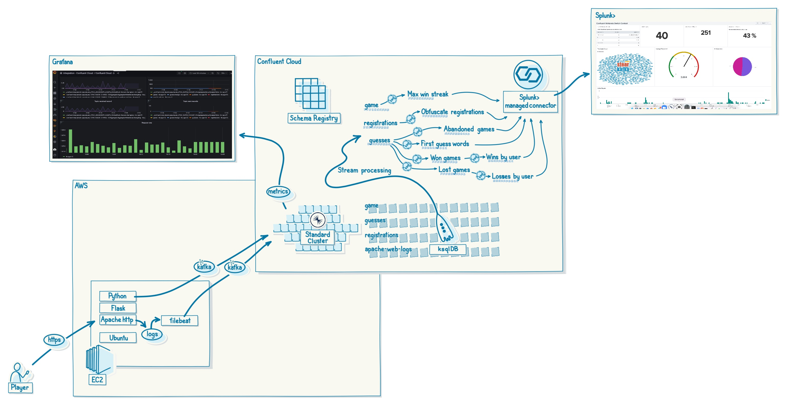

# Overview

The Confluent Wordle Demo (CWD)

This demo is based on the New York Time Wordle game.
The original game can be found here: [Wordle](https://www.nytimes.com/games/wordle/index.html)

The demo re-uses the works of Tommy Dougiamas, a Computer Science student at UWA in Perth Western Austrlia (where I live!).
His github repo is here: [exciteabletom/wordle-API](https://github.com/exciteabletom/wordle-API)

The following changes were made to his code:
* A Registration page was created to capture player details so a prize can be awarded
* Kafka producer code was added to stream game play into a Confluent Cloud cluster
* Removed the ability to share the game number you are playing (so you can't cheat)
* Added links to https://developer.confluent.io 

See below for how it hangs together. BY default, the demo sends data back to a Splunk Enterprise trial license on the same host using a Fully Managed Splunk Sink Connector within Confluent Cloud. You could configure this to to to a Splunk Cloud Trial if you prefer.



# Prerequisites

* An appropriately sized virtual machine somewhere running Ubuntu 22.04
* I'd suggest an AWS T2.large or xlarge (2 CPU, 8GB & 20GB of disk because we'll install Splunk for dashboarding)
* A publicly routable IP address and a configured FQDNS A record that will work with Letsencrypt
* An active Confluent Cloud login (the script will use the CLI to provision a Confluent Basic Cluster and setup everything) 

# Installation

1. Log into your ubuntu instance and pull down the git repo.
```
git clone https://github.com/pwildconfluentio/cwd.git
```
2. Enter the CWD directory and edit the env.config file, setting the environment variables to match your setup.
    You will need a FQDN assigned to your host so that letscencrypt can issue a certificate.
    You'll need to define where you want to fire up the Confluent Cloud cluster components
    And you'll need to supply an email address for letsencrypt configuration
```
cd cwd
nano env.config
```
3. Run the setup script
```
./setup-cwd.sh
```

The setup script performs the following actions.
* Install required python3, apache2-httpd, flask, kafka, certbot, docker packages
* Download and install Elastic filebeat to stream the webserver logs
* Run docker-compose to setup splunk, install needed apps and configure the http event collector
* Configure the apache webserver to run WSGI and support a python-flask app. Also setup a reverse proxy for the Splunk UI
* Install the Confluent CLI and ccloud helper script
* Prompt for the Confluent Cloud login credentials, then
  * Create a new environment
  * Create a basic Cluster
  * Create the needed topics
  * Create a ksqlDB cluster
  * Setup persistent SQL queries
  * Setup a fully managed Splunk sink connector
* After the Confluent Cloud components are setup, the script will populate any needed config files with any required credentials for Confluent Cloud.

If all goes well, once the script completes execution, everything should be setup and usable.

You can get to the game by browsing to your URL

I'd suggest you create a QR code to make it easier for people with mobile devices. The game does not render well for computer based screens.

To log into Splunk to see the dashboards, browse to your URL/splunk

Login creds are admin:Password1 (I will suggest you change this when you first login).

The above image shows metrics observability in Grafana. This is easy to setup but requires an account and credentials for grafana.net. Configuration is performed on the grafana side after API keys are created. It is not automated within the script.

# Note

The confluent cli is installed into 
```
~/cwd/bin/
```
To use the cli, you will need to add this to your path
```
export PATH=~/cwd/bin:$PATH
confluent login --save
```

To destroy the environment at completion of the demo, log into the host and run the following
```
cd ~/cwd
export PATH=~/cwd/bin:$PATH
confluent login --save
./stop-cloud.sh stack-configs/java-service-account-XXXX
```
There should only be one config file in the stack-configs directory, hopefully matching your Confluent Cloud environment.

